# Night Owl Theme

A cozy, nocturnal color theme adapted from the Night Owl look & feel used inside the opencode CLI. Tweaked just enough for crisp readability, gentle contrast, and that late‑night "I got this" vibe.

## Features
- Calming blues with focused highlights
- Warm accents for important bits
- Soothing dark background for long sessions

## Installation

Drop a theme file into the proper configuration directory for the specific program and load the theme per the instructions. That’s it!

## Inspiration

Originally inspired by the Night Owl aesthetic embraced in the opencode CLI, this flavor keeps the spirit while polishing a few tones for extra comfort.

## Palette

See `assets/palette.svg` above for the core swatches.

## Contributing

Spotted a hue that feels off? Open an issue or send a tweak.

## License

MIT – see `LICENSE.txt`.

Happy hacking under the stars! 🌙
